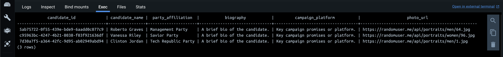

Realtime Election Voting System
================================

A real-time election voting system built with Python, Kafka, Spark Streaming, PostgreSQL, and Streamlit. Services are orchestrated with Docker Compose.

## System Architecture


## System Flow


## Project Structure

```
realtime-voting/
├── config/                     # Centralized configuration (env-based)
│   └── settings.py             # Settings singleton (database, kafka, spark, app)
├── models/                     # Pydantic v2 data models
│   ├── candidate.py            # Candidate model
│   ├── voter.py                # Voter model
│   └── vote.py                 # Vote model + PySpark schema
├── services/                   # Business logic services
│   ├── data_generator.py       # Voter/candidate generation via randomuser.me
│   └── voting_service.py       # Vote creation and persistence
├── kafka_utils/                # Kafka producer/consumer wrappers
│   ├── producer.py             # KafkaProducerWrapper (confluent_kafka)
│   ├── consumer.py             # KafkaConsumerWrapper, StreamlitKafkaConsumer
│   ├── serializers.py          # JSON serialization utilities
│   └── exceptions.py           # Kafka-specific exceptions
├── database/                   # PostgreSQL data access layer
│   ├── connection.py           # Connection management
│   ├── repositories.py         # CRUD repositories
│   ├── schemas.sql             # Table definitions
│   └── exceptions.py           # Database-specific exceptions
├── ui/                         # Streamlit UI components
├── main.py                     # Setup: DB tables, Kafka topics, voter generation
├── voting.py                   # Voting simulation: consume voters, produce votes
├── spark-streaming.py          # Spark: aggregate votes and publish to Kafka
├── streamlit-app.py            # Dashboard: real-time vote visualization
├── .env.example                # Example environment variable configuration
├── docker-compose.yml          # Zookeeper, Kafka, PostgreSQL containers
├── pyproject.toml              # Poetry dependency management
└── postgresql-42.7.2.jar       # JDBC driver for Spark ↔ PostgreSQL
```

## System Components

- **`main.py`**: Initialises the system — creates PostgreSQL tables (`candidates`, `voters`, `votes`), Kafka topics, generates candidates, and publishes voter data to `voters_topic`.
- **`voting.py`**: Consumes voter data from `voters_topic`, randomly assigns a candidate, and publishes enriched vote records to `votes_topic`.
- **`spark-streaming.py`**: Reads votes from `votes_topic`, aggregates by candidate and by location, then streams results to `aggregated_votes_per_candidate` and `aggregated_turnout_by_location` Kafka topics.
- **`streamlit-app.py`**: Reads aggregated data from Kafka and PostgreSQL, rendering a live dashboard with vote counts, leading candidate, and turnout breakdown.

## Prerequisites

- Python 3.11+
- Docker and Docker Compose
- [Poetry](https://python-poetry.org/) (recommended) or `pip`

## Setting Up

### 1. Start infrastructure services

```bash
docker-compose up -d
```

This starts Zookeeper, Kafka (`localhost:9092`), and PostgreSQL (`localhost:5432`) in detached mode.

### 2. Configure environment

```bash
cp .env.example .env
# Edit .env as needed (defaults work for local Docker setup)
```

Key variables:

| Variable | Default | Description |
|---|---|---|
| `POSTGRES_HOST` | `localhost` | PostgreSQL host |
| `POSTGRES_DB` | `voting` | Database name |
| `KAFKA_BOOTSTRAP_SERVERS` | `localhost:9092` | Kafka broker address |
| `NUM_CANDIDATES` | `3` | Number of candidates to generate |
| `NUM_VOTERS` | `500` | Number of voters to generate |
| `VOTING_DELAY_SECONDS` | `0.2` | Delay between votes (simulation speed) |
| `PARTIES` | `Management Party,...` | Comma-separated party names |

### 3. Install dependencies

Using Poetry (recommended):
```bash
poetry install
poetry shell
```

Or with pip:
```bash
pip install -r requirements.txt
```

## Running the App

Run each component in a **separate terminal**, in order:

**Terminal 1 — Initialise DB and generate data:**
```bash
python main.py
```

**Terminal 2 — Run voting simulation:**
```bash
python voting.py
```

**Terminal 3 — Start Spark aggregation:**
```bash
python spark-streaming.py
```

**Terminal 4 — Launch the dashboard:**
```bash
streamlit run streamlit-app.py
```

The Streamlit dashboard will be available at `http://localhost:8501`.

## Screenshots

### Candidates and Parties


### Voters


### Voting


### Dashboard

